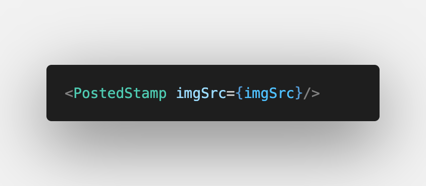
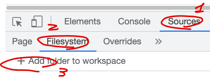

# Web app flow chart

## Create a vite react project

```bash
npm init vite@latest my-react-app --template react
```

## Open the project folder in VS Code

```bash
cd my-react-app
```

## Install dependencies

```bash
npm install 
```

# Think as a Module

  * How would you use your Component? 
    * Becomes a module
  * Design component as a module:
    * What are the inputs?
    * What are the helper functions?
    * What are the `export` or is the `export default`?

## How would you use your Component?



We are talking about using it outside its source `.jsx` file. The usage tells us the following:

  * The Module name is `PostedStamp`: meaning there is a folder called `PostedStamp` and there is a file called `index.jsx` inside the folder.
  ```
  /PostedStamp/index.jsx
  ```
  * Inside the `index.jsx` file, there is an 
  ```
  export (export) function PostedStamp({imgSrc}){


    return (a jsx element)
  }
  ```
  function definition with a property named `imgSrc` and return a `jsx` element.

## Design component function

  * Use Figma; or
  * Use some framework, like MUI; or
  * A mixture of both.


## Test your component module

  * The easiest way is to import it and use it in `App.jsx`.

### Setup chrome

  * Install [react developer tools](https://chrome.google.com/webstore/detail/react-developer-tools/fmkadmapgofadopljbjfkapdkoienihi) extension.
  * Setup workspace folder as




# Card

## How would I use

Each card requires

```
const stampOption = {
    variant: number, //choose seal design, including css adjustment accordingly, excluding stamp left/bottom/rotation
    stampLocation: {
        left: string, //css left
        bottom: string, //css bottom
        transform: string //css transform
    }
}
const stampOptionExample={
    variant: 2,
    stampLocation: {
        left: "-20px",
        bottom: "-30px",
        transform: "rotate(-65deg)"
    }
}
<Card user={user} stampOption={stampOptionExample}/>
```

```
import Card as Card1
import Card as Card2

const cardOptions = [Card1, Card2, ...., Card6]

// random select
var Card = cardOptions[random_integer]

<Card user={user} stampOption = {}/>
```

```

  <Stamp stampOption = {stampOption}>
```

```
export Stamp({imgSrc}){

}